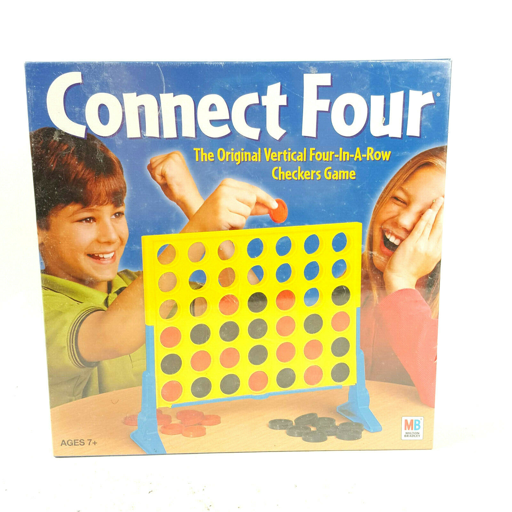

# Connect Four

## Objective
Connect four of your checkers in a row while preventing your opponent from doing the same.

## Category
* **Zero-Sum:** a player's gain or loss is exactly balanced by the gain or loss of the opponent.
If the total gains are added and the total losses subtracted, their sum is zero.
* **Perfect Information:** Players have all the information about moves which have taken place and all moves which can take place,
for a given game state.